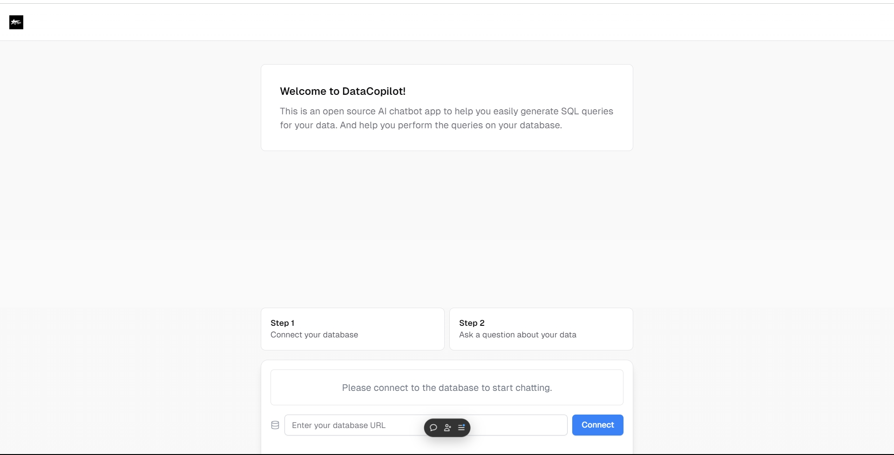

# Responsible LLM Hackathon - Team 8

## Project Overview

This project was developed as part of the **2024 Responsible LLM Hackathon**. The goal of the hackathon was to create an application that integrates **Large Language Models (LLMs)** responsibly into collaborative systems. Our application emphasizes responsible AI usage, inclusivity, and accessibility.

---

## Demo



## Document and Sources Link
https://utoronto-my.sharepoint.com/personal/jiessie_tie_mail_utoronto_ca/_layouts/15/onedrive.aspx?id=%2Fpersonal%2Fjiessie%5Ftie%5Fmail%5Futoronto%5Fca%2FDocuments%2FResponsible%20LLM%2DHackathon%2FTeam8%2FFinal%20Submission&ga=1

## Live Application

Access the live version of our application here (currently using HTTP deployment):  
**[Live Demo - Vercel Deployment](http://llm-hack-team8-git-leo-branch-alezhibalis-projects.vercel.app/)**

> **Note:** HTTPS deployment is not yet finalized. Please follow the [Vercel HTTP discussion](https://github.com/vercel/vercel/discussions/5287#discussioncomment-3596055) to enable HTTP Connections.

---

## Front-End Repository

The front-end of the application is located in the following repository:

- **[Front-End GitHub Repository (Leo Branch)](https://github.com/AlezHibali/2024-oct-4-responsible-llm-hackathon/tree/leo-branch)**

This repository includes all the front-end code, built with modern web technologies and designed for an intuitive user experience.

---

## Database

This project uses a **PostgreSQL** database for data management. Below is an example of the database connection string:

```
postgresql://alezhibali
@league-teams-stat-2023.chck4ckqwqjq.us-east-1.rds.amazonaws.com:5432/postgres

```